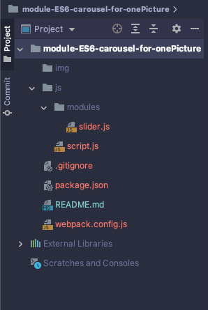

# module-carousel-for-onePicture
Модуль содержит js-скрипт, который создаст зацикленный слайдер-карусель с просмотром одной картинки, с кнопками Вперёд / Назад и с кнопками-переходами на любой слайд.

<br />

## Дерево файлов и каталогов
Необходимо сформировать файловое дерево в соответствие с настройками ___Webpack___ и ___GulpJS___. Данные настройки находятся в одноименных файлах: ___webpack.config.js___ и ___gulpfile.js___, если таковые имеются в репозитории.

<br />



> Важно! В подключаемых файлах важно прописать правильные пути. Большинство ошибок это ошибки в путях.

<br />

## Подключение модуля
В данном репозитории точкой вхождения ___Webpack___ является _./js/script.js_.
<br /> Импортируем в него модуль со скриптом слайдера:
```javascript
// Это точка вхождения Webpack: "./js/script.js'
"use strict";

import slider from './modules/slider';

window.addEventListener('DOMContentLoaded', () => {
    slider({
        container: '.offer__slider',
        slide: '.offer__slide',
        nextArrow: '.offer__slider-next',
        prevArrow: '.offer__slider-prev',
        totalCounter: '#total',
        currentCounter: '#current',
        wrapper: '.offer__slider-wrapper',
        field: '.ofer__sleder-inner',
        indicatorsSelector: 'ol',
    });
});
```
<br />

## Деструктуризация объекта с аргументами
Функция slider() принимает объект следующих аргументов {}:

| Ключ | Значение | Значение селектора | 
| :---- | :---- | :--- |
| container | .offer__slider | Селектор является контейнером для всего слайдера, в который будем добавлять js-верстку |
| slide | .offer__slide | Непосредственно слайды |
| nextArrow | .offer__slider-next | Стрелка управления ВПЕРЁД|
| prevArrow | .offer__slider-prev | Стрелка управления НАЗАД |
| totalCounter | #total | Отображает общее количество слайдов |
| currentCounter | #current | Отображает номер текущего слайда |
| wrapper | .offer__slider-wrapper | Аналог окна просмотра текущего слайда из ряда всех слайдов |
| field | .ofer__sleder-inner | Управление стилей оболочки слайдов |
| indicatorsSelector | .ol | Массив, в который пушится точки-управления |

